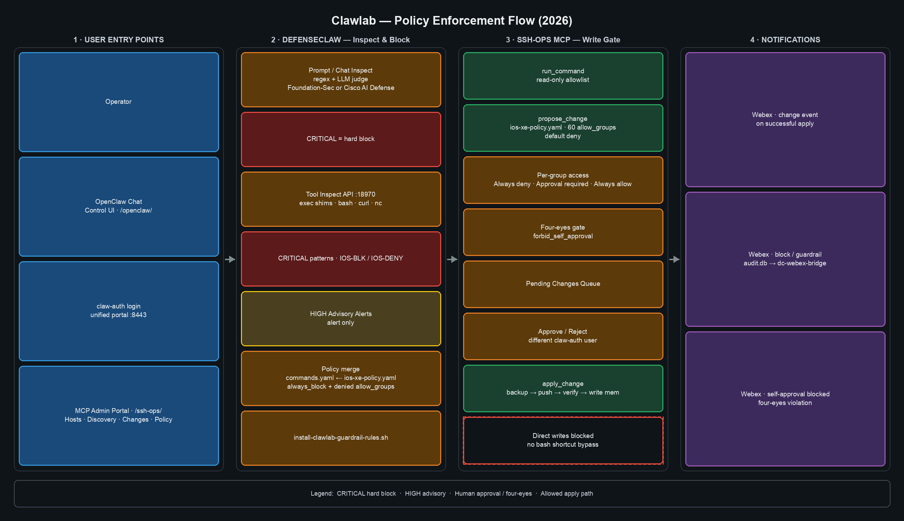

# clawlab

Self-hosted AI-ops lab: a governed **OpenClaw** agent with **Cisco DefenseClaw**
guardrails, a hardened **ssh-ops** MCP for network changes, a unified HTTPS admin
portal (**claw-auth**), and **Webex** alerting on policy violations.



See **[docs/ARCHITECTURE.md](docs/ARCHITECTURE.md)** for ports, auth model, LLM routing,
and the full operational runbook.

> **Secrets never live here.** Tokens, API keys, Fernet keys, and LE private keys stay
> on the host under `~/.openclaw`, `~/.defenseclaw`, `~/.claw-auth`, etc. Sanitized
> templates live in `config-templates/`.

---

## What this stack does

| Layer | Role |
|-------|------|
| **OpenClaw** | Agent gateway (`:18789`) — chat, tools, MCP clients |
| **DefenseClaw** | Prompt/tool inspect, regex + LLM judge, exec shims, audit |
| **ssh-ops MCP** | Read-only `run_command` + gated `propose_change` / `apply_change` |
| **Portal :8443** | Single URL — OpenClaw, MCP Admin, DefenseClaw policy editor |
| **claw-auth** | Shared login for all admin tabs (SQLite sessions) |

**Policy flow (summary):** Operator → agent proposes change → DefenseClaw blocks
bad tool/prompt patterns → ssh-ops validates IOS-XE allow groups → human approves
(four-eyes) → `apply_change` pushes config → Webex notifies on apply or block.

Regenerate the diagram after edits:

```bash
python3 admin-access/render-policy-flow-diagram.py
```

---

## Install order (3 scripts)

Run these in order on a **new host**. Each step is idempotent (safe to re-run).

| Step | Script | What it does | When |
|------|--------|--------------|------|
| **1** | `install/preinstall-check.sh` | Read-only checklist: Node, pnpm, Ollama models, DefenseClaw config, portal, podman | Before anything else; use `--fix` for conservative apt/brew/pnpm fixes |
| **2** | `install/install-clawstack.sh` | OpenClaw + DefenseClaw, providers, MCP, guardrail + judge backend; **`local-full`** adds portal `:8083` + ssh-ops MCP/GUI | Every new stack; **`local-full`** default on macOS (self-contained desktop); **`local`** = agent-only; **`server`** = legacy Linux |
| **3** | `claw-portals/install-portals.sh` | HTTPS nginx `:8443`, claw-auth, portal tabs, LE TLS (optional) | **Linux lab host** after step 2 (icecream production path) |

```bash
git clone https://github.com/nabboyd/clawlab.git ~/clawlab
cd ~/clawlab

# 1 — prerequisites (optional --fix)
bash install/preinstall-check.sh --fix

# 2 — full desktop stack on Mac (interactive; Enter accepts defaults)
bash install/install-clawstack.sh --local-full
# non-interactive: bash install/install-clawstack.sh --local-full --yes
# or interactive: bash install/install-clawstack.sh  (default mode local-full on macOS)

# 3 — production HTTPS portal on Linux lab host (skip on Mac local-full)
bash claw-portals/install-portals.sh
```

**macOS (self-contained, like icecream without LE):** steps **1 → 2 with `local-full`** — bookmark `http://127.0.0.1:8083/`

**Linux lab server (icecream):** steps **1 → 2 (`local` or `local-full`) → 3** for `:8443` HTTPS + Let's Encrypt

**DefenseClaw scan backend** (step 2 prompt): **local** (Ollama Foundation-Sec judge), **cisco** (AI Defense API), or **both**.

For install checks, portal diagnostics, and policy refresh helpers, see
**[docs/Troubleshooting scripts.md](docs/Troubleshooting%20scripts.md)**.

---

## First login & OpenClaw device pairing

> **Do this once per browser** after install. Same flow on **`local-full`** (`http://127.0.0.1:8083/`) and
> **lab server** (`https://<host>:8443/` with `install-portals.sh` + claw-auth).

| Step | Who | Action |
|------|-----|--------|
| **1** | Admin | Create portal user if none exists: `python claw-auth/manage.py create-user admin` |
| **2** | Anyone | Open the portal hub and sign in |
| **3** | Anyone | **OpenClaw** tab → **Open OpenClaw ↗** (new window with gateway token) |
| **4** | **Admin only** | **OpenClaw devices** tab → **Approve** the pending browser device |
| **5** | Anyone | Return to the OpenClaw Control UI — it should connect |

**Admin-only tab:** The **OpenClaw devices** tab appears only for users with role **`admin`**
(manage roles via **Users** on the hub or `claw-auth/manage.py create-user alice --role operator`).
Non-admin operators see a banner asking them to contact an admin; they cannot approve devices.

**CLI fallback** (SSH on the gateway host):

```bash
openclaw devices list
openclaw devices approve <request-id>
```

**Verify local-full stack:** `bash install/verify-local-full.sh`

---

## Quick start

### macOS desktop stack (`local-full`)

After install, manage the loopback stack without systemd:

```bash
bash install/local-full-ctl.sh status
bash install/local-full-ctl.sh restart   # after config changes

# Verify stack
bash install/verify-local-full.sh

# Portal hub
open http://127.0.0.1:8083/
```

See **[First login & OpenClaw device pairing](#first-login--openclaw-device-pairing)** above for the full first-connect flow.

```bash
# First login user (if none yet)
~/.clawlab/venv/bin/python claw-auth/manage.py create-user admin
```

### Live demo (after stack is up)

```bash
bash demo/clawlab-demo.sh              # narrated walkthrough
bash demo/clawlab-demo.sh --fast       # no pauses
bash tests/policy-test.sh --no-agent   # full deterministic policy matrix
```

### Lab host redeploy (icecream)

```bash
cd ~/clawlab && git pull
bash claw-portals/install-portals.sh --non-interactive --tls=https-le --auth=claw-auth
systemctl --user restart claw-auth defenseclaw-webgui openclaw-gateway
podman build -t ssh-ops:latest ~/clawlab/ssh-ops-mcp
systemctl --user restart ssh-ops-gui
bash claw-auth/doctor.sh
```

After redeploy, use the same **[device pairing flow](#first-login--openclaw-device-pairing)** on `:8443`.

---

## Unified portal

| Tab | Path | Backend | Access |
|-----|------|---------|--------|
| OpenClaw Control UI | `/openclaw/` | `127.0.0.1:18789` | All signed-in users (token + device pairing) |
| **OpenClaw devices** | `/admin/openclaw-devices` | claw-auth → gateway `:18789` | **Admin only** — approve browser pairing |
| MCP Admin (ssh-ops) | `/ssh-ops/` | `127.0.0.1:8765` | All signed-in users |
| DefenseClaw policies | `/defenseclaw/` | `127.0.0.1:8770` | All signed-in users |

Default URL: `https://<host>:8443/` (HTTP lab: `:8083`). OpenClaw opens in a new
window; MCP Admin, DefenseClaw, and **OpenClaw devices** load in the hub via iframes.

**`local-full` vs lab server:** Device approval uses the same claw-auth UI and gateway API
on loopback (`127.0.0.1:18789`). Both `local-full` nginx (`:8083`) and `install-portals.sh`
(`:8443`, claw-auth mode) proxy `/admin/` to claw-auth. Requires claw-auth and the OpenClaw
gateway on the **same host** (standard install layout).

---

## Repository layout

### Install scripts (run in order)

| Script | Path |
|--------|------|
| 1 · Pre-install check | `install/preinstall-check.sh` |
| 2 · Core stack | `install/install-clawstack.sh` (`local` / **`local-full`** / `server`) |
| 2b · Local-full ctl | `install/local-full-ctl.sh` (start/stop portal + MCP on Mac) |
| 3 · HTTPS portal (lab) | `claw-portals/install-portals.sh` |

Shared helpers: `install/lib/clawlab-platform.sh` (OS detection, Node/pnpm, Ollama, DefenseClaw config patch).

### Other paths

| Path | Purpose |
|------|---------|
| `demo/` | **`clawlab-demo.sh`** — high-level good/bad behavior demo |
| `claw-auth/` | Centralized SQLite auth for admin portals |
| `ssh-ops-mcp/` | Hardened SSH MCP + admin GUI (Podman) |
| `defenseclaw-webgui/` | Policy editor (guardrail, rule packs, webhooks) |
| `defenseclaw-webex-bridge/` | Audit → Webex on HIGH/CRITICAL violations |
| `admin-access/` | Guardrail rules install, policy refresh, diagram render |
| `config-templates/` | Sanitized `openclaw.sample.json`, `defenseclaw.sample.yaml`, IOS-XE policy |
| `tests/` | Policy harness (`policy-test.sh`), scenario scripts |
| `docs/` | Architecture, scenarios, **policy enforcement diagram** (`.mmd` + `.png`) |
| `quadlets/` | Rootless Podman units for ssh-ops |
| `systemd-user/` | Gateway, cert renewal, shim heal, Webex bridge |
| `skills/` | `defenseclaw-canary`, `fleet-update`, `system-updater` |

---

## Bring-up (manual / piecemeal)

Prefer the **3-script install order** above. For ad-hoc assembly:

1. `bash install/preinstall-check.sh --fix`
2. `bash install/install-clawstack.sh` (or copy templates manually below)
3. Copy `config-templates/*.env.example` → real `.env` locations; fill secrets locally.
4. Copy `config-templates/openclaw.sample.json` → `~/.openclaw/openclaw.json`.
   Each provider needs a `models: [...]` array or the gateway crashes in failover.
5. Copy `config-templates/defenseclaw.sample.yaml` → `~/.defenseclaw/config.yaml`.
6. `bash claw-portals/install-portals.sh` for TLS + nginx + claw-auth.
7. `bash admin-access/install-clawlab-guardrail-rules.sh` for clawlab IOS-XE + CRUD rules.
8. `systemctl --user enable --now openclaw-gateway` (and ssh-ops quadlets / webgui as needed).

Pull judge model (local DefenseClaw backend):

```bash
ollama pull hf.co/fdtn-ai/Foundation-Sec-8B-Q8_0-GGUF:Q8_0
```

---

## LLM roles

| Role | Default |
|------|---------|
| OpenClaw agent primary | `ollama/llama3.1:8b` |
| Agent fallback | Anthropic Claude |
| DefenseClaw judge | Ollama Foundation-Sec-8B (or Cisco AI Defense when `scanner_mode: remote/both`) |

---

## Notes

- Admin UIs bind loopback; LAN access is via nginx + claw-auth on `:8443`.
- DefenseClaw enforces via fetch interceptor, sidecar inspect (`:18970`), and exec shims.
- IOS-XE changes use **60 granular `allow_groups`** — see `config-templates/ios-xe-policy.yaml`.
- After policy edits: `bash admin-access/refresh-clawlab-policies.sh --preserve-access`
  or Policy tab → Reload policy & restart gateways.
- **Troubleshooting:** [docs/Troubleshooting scripts.md](docs/Troubleshooting%20scripts.md) — script index with flags.
