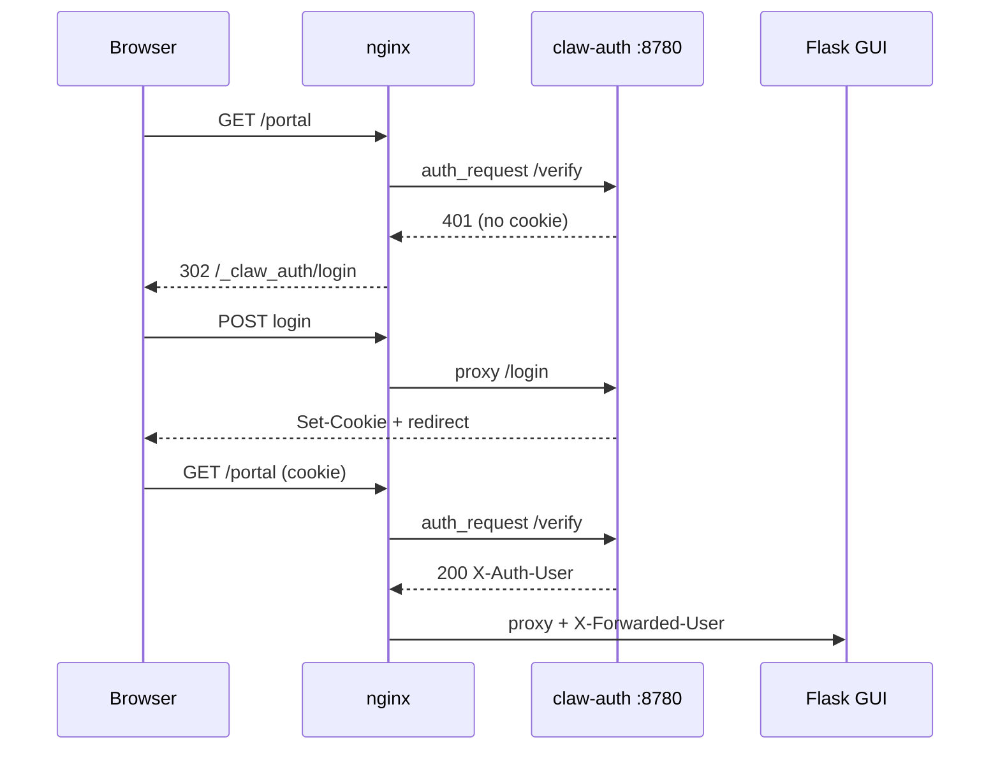

# claw-auth — centralized lightweight auth for clawlab portals

SQLite-backed user database shared by the ssh-ops admin GUI, OpenClaw Control UI,
and DefenseClaw policy editor. Replaces Linux PAM for portal login when deployed
via `claw-portals/install-portals.sh`.

## Features

- **SQLite user store** at `~/.claw-auth/users.db` (0600)
- **Server-side sessions** — HttpOnly cookie, configurable TTL (default 24h)
- **nginx auth_request** integration — one login flow per portal port
- **User admin UI** at `http://127.0.0.1:8780/admin/users`
- **CLI** for non-interactive user management

Passwords are hashed with Werkzeug's scrypt-based hasher (via Flask).

## Install

Recommended — use the unified portal installer:

```bash
cd claw-portals
chmod +x install-portals.sh
./install-portals.sh
```

Choose **claw-auth** when prompted for authentication mode.

Manual install:

```bash
cd claw-auth
pip install -r requirements.txt
python3 manage.py create-user admin
python3 authd.py   # http://127.0.0.1:8780
```

## Manage users

```bash
python3 manage.py create-user alice
python3 manage.py list-users
python3 manage.py set-password alice
python3 manage.py delete-user alice
```

## How it works



Flask backends set `CLAW_AUTH_REQUIRED=1` (via `~/.claw-portals/config.env`) to
reject direct loopback access without a proxy identity header.

## Environment

| Variable | Default |
|----------|---------|
| `CLAW_AUTH_HOME` | `~/.claw-auth` |
| `CLAW_AUTH_PORT` | `8780` |
| `CLAW_AUTH_COOKIE` | `claw_session` |
| `CLAW_AUTH_SECURE` | `auto` (Secure cookie when HTTPS) |
| `CLAW_AUTH_SESSION_HOURS` | `24` |
| `CLAW_PORTAL_*_URL` | Portal hub links |

## Multi-port note

Browsers treat each TCP port as a separate origin, so users sign in once per
portal port (8443, 8444, 8445). All portals share the **same user database** —
only the session cookie is port-scoped.

## Security

- Binds to loopback only; exposed via nginx reverse proxy
- Never store plaintext passwords
- Session tokens are random 256-bit values
- Use HTTPS in production (`install-portals.sh` → Let's Encrypt)
