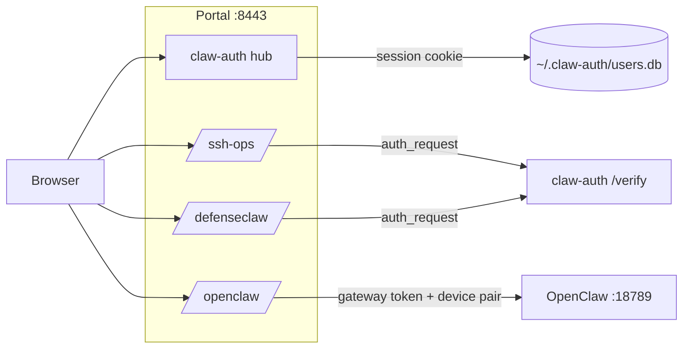

# clawlab architecture

Self-hosted AI-ops lab on host **icecream** (`icecream.naboydciscolab.com`, LAN
`192.168.128.93`). Governed OpenClaw agent, Cisco DefenseClaw policy enforcement,
hardened ssh-ops MCP, and a unified HTTPS admin portal.

> **Secrets never live in git.** Tokens, API keys, Fernet keys, and LE private keys
> stay on the host under `~/.openclaw`, `~/.defenseclaw`, `~/.claw-auth`, etc.

---

## High-level view

```text
                         Internet / LAN
                               │
                    HTTPS :8443 (Let's Encrypt)
                               │
                    ┌──────────▼──────────┐
                    │  nginx (system)     │
                    │  clawlab-portal.conf│
                    └──────────┬──────────┘
           ┌───────────────────┼───────────────────┐
           │                   │                   │
      /  (hub)            /ssh-ops/          /defenseclaw/
           │                   │                   │
    claw-auth :8780      ssh-ops GUI :8765   DC webgui :8770
           │
    /openclaw/  ──────────────────────────► OpenClaw gateway :18789
    (no nginx auth_request; token + device pairing)
```

**Design principle:** one public admin listener (`:8443`). All app backends bind
loopback only.

---

## Public vs loopback ports

| Port | Exposure | Service |
|------|----------|---------|
| **8443** | LAN / FQDN (nginx + LE TLS) | Unified portal hub |
| 18789 | `127.0.0.1` only | OpenClaw gateway + Control UI |
| 8765 | `127.0.0.1` only | ssh-ops admin GUI (Podman) |
| 8766 | HTTPS (MCP bearer token) | ssh-ops MCP API |
| 8770 | `127.0.0.1` only | DefenseClaw policy editor |
| 8780 | `127.0.0.1` only | claw-auth (login + verify) |
| 4000 | `127.0.0.1` | DefenseClaw guardrail proxy |
| 11434 | `127.0.0.1` | Ollama (local LLM) |

---

## Unified portal

**Bookmark:** `https://icecream.naboydciscolab.com:8443/`

| Path | Backend | Auth |
|------|---------|------|
| `/` | claw-auth hub (`:8780`) | Session cookie (SQLite users) |
| `/_claw_auth/*` | claw-auth | Login / logout / verify |
| `/ssh-ops/` | ssh-ops GUI (`:8765`) | nginx `auth_request` → claw-auth |
| `/defenseclaw/` | policy editor (`:8770`) | nginx `auth_request` → claw-auth |
| `/openclaw/` | OpenClaw gateway (`:18789`) | Gateway token + device pairing (no nginx auth) |

**Hub behavior**

- MCP Admin and DefenseClaw load in iframes inside the hub.
- OpenClaw opens in a **new window** (the gateway blocks iframe embedding).
- The hub link passes `?gatewayUrl=wss://<same-host>:8443/openclaw/#token=<token>`.

**nginx (`claw-portals/install-portals.sh` → `/etc/nginx/sites-enabled/clawlab-portal.conf`)**

- Single site on `:8443`; legacy per-port configs (`ssh-ops-admin.conf`, etc.) are removed.
- `/openclaw` is proxied directly (no 301 redirect) — browsers cannot complete WSS upgrade through redirects.
- WebSocket: `proxy_buffering off`, upgrade headers on `/openclaw/`.

Installer:

```bash
bash claw-portals/install-portals.sh --non-interactive --tls=https-le --auth=claw-auth
```

---

## Authentication



| Component | Auth mechanism |
|-----------|----------------|
| **claw-auth** | SQLite users, HttpOnly session cookie, `/_claw_auth/verify` for nginx |
| **ssh-ops GUI** | claw-auth + `X-Auth-User` from nginx; direct `:8765` → 403 |
| **ssh-ops MCP** | Bearer token on `:8766` (separate from portal session) |
| **DefenseClaw GUI** | claw-auth via nginx |
| **OpenClaw Control UI** | `OPENCLAW_GATEWAY_TOKEN` via `#token=` URL fragment; one-time device pairing |

OpenClaw uses **token mode** (not trusted-proxy). Same-host nginx → loopback does not
satisfy trusted-proxy for the Control UI, and token + trusted-proxy are mutually
exclusive in OpenClaw.

Token portal setup:

```bash
python3 admin-access/apply-token-portal.py
systemctl --user restart openclaw-gateway claw-auth
```

Print a working Control UI URL:

```bash
bash admin-access/print-gateway-url.sh
```

---

## OpenClaw stack

```text
Browser Control UI
    │  WSS wss://<host>:8443/openclaw/
    ▼
nginx :8443  ──proxy──►  openclaw-gateway :18789
                              │
                    ┌─────────┴─────────┐
                    │ DefenseClaw plugin │
                    │ (fetch interceptor)│
                    └─────────┬─────────┘
                              │ localhost:4000
                              ▼
                    defenseclaw-gateway (guardrail proxy)
                              │
                    regex rules + LLM judge (Ollama)
```

**Config:** `~/.openclaw/openclaw.json`

- `gateway.auth.mode`: `token`
- `gateway.auth.token`: `${OPENCLAW_GATEWAY_TOKEN}` (SecretRef — not a literal string)
- `controlUi.basePath`: `/openclaw`
- `controlUi.allowInsecureAuth`: `true` (needed for HTTPS portal / HTTP tunnel cases)
- `allowedOrigins`: portal HTTPS hosts + loopback origins

**Service:** `openclaw-gateway.service` (user systemd)

**First browser connect:** approve device pairing on the gateway host:

```bash
openclaw devices list
openclaw devices approve <request-id> --token "$OPENCLAW_GATEWAY_TOKEN"
```

---

## DefenseClaw governance

**Upstream:** [cisco-ai-defense/defenseclaw](https://github.com/cisco-ai-defense/defenseclaw) cloned to `~/src/defenseclaw`

**Runtime home:** `~/.defenseclaw/`

```text
~/.defenseclaw/
├── config.yaml              # main config (guardrail, actions, webhooks)
├── audit.db                 # violation audit log
├── policies/
│   ├── defenseclaw-policy.yaml   # OPA admission policy
│   └── guardrail/
│       ├── strict/          # active rule pack (regex + judge prompts)
│       ├── default/
│       └── permissive/
├── shims/                   # curl, nc, wget, … (exec interception)
└── extensions/defenseclaw/  # OpenClaw plugin
```

### Two policy layers

| Layer | Controls | Tuning |
|-------|----------|--------|
| **OPA policy** | Severity → block / alert / quarantine | `defenseclaw policy activate` or Actions tab in web GUI |
| **Rule pack** | Regex rules, judge YAML, suppressions | Rule pack tab → `rules/*.yaml`, `suppressions.yaml` |

**Install default** (`install/install-clawstack.sh`):

```bash
defenseclaw setup guardrail --connector openclaw --mode action \
  --rule-pack strict --detection-strategy regex_judge
```

**Policy editor:** `defenseclaw-webgui` on `:8770`, portal path `/defenseclaw/`

**Alerting:** `defenseclaw-webex-bridge` tails `audit.db` → Webex on HIGH/CRITICAL violations

**Fine-tuning docs (on host):** `~/src/defenseclaw/docs/GUARDRAIL_RULE_PACKS.md`

After policy edits: reload gateway from Overview tab, then run the `defenseclaw-canary` skill
or `tests/policy-test.sh` to verify enforcement.

---

## ssh-ops MCP

```text
OpenClaw agent ──MCP HTTPS :8766──► ssh-ops MCP (Podman)
                                         │
                                    Fernet creds (~/.ssh-ops-mcp/)
                                         │
                                    SSH to fleet hosts (hosts.yaml)
```

- **Admin GUI:** Podman `ssh-ops-gui` on `:8765`, portal `/ssh-ops/`
- **Quadlets:** `quadlets/ssh-ops-gui.container`, `ssh-ops-mcp.container`
- **Policy file:** `/data/ios-xe-policy.yaml` (writable; seeded from image on first start)
- **MCP Admin tabs:** Hosts, Discovery, **Changes** (propose/approve/apply), **Policy** (per-group access)

### IOS-XE change governance

Single source of truth: `config-templates/ios-xe-policy.yaml` (**60 granular `allow_groups`**
in **11 categories**, aligned with IOS-XE 17.17 Catalyst 9200 Command Reference —
see `docs/ios-xe-command-reference-index.yaml`).

| Layer | Enforces |
|-------|----------|
| DefenseClaw prompt/tool inspect | `always_block` → CRITICAL; denied groups → `IOS-DENY-*` CRITICAL |
| DefenseClaw HIGH advisories | Risky-but-permitted patterns from allowed groups |
| MCP `run_command` | Read-only allowlist only |
| MCP `propose_change` | `always_block` + selected `allow_groups` (default deny) |
| Per-group access (Policy tab) | **deny** / **approve** / **allow** (admin-only save + reload button) |
| Four-eyes approval | Proposer cannot approve own change (`forbid_self_approval`) |
| `apply_change` | Requires `approved` status; backup → push → verify → write mem |


Regenerate after layout edits: `python3 admin-access/render-policy-flow-diagram.py`
(source: `docs/clawlab-policy-enforcement-flow.mmd`, renderer: `admin-access/render-policy-flow-diagram.py`).

Merge DefenseClaw rules after policy edits:

```bash
bash admin-access/refresh-clawlab-policies.sh --preserve-access
# or Policy tab → Reload policy & restart gateways (admin)
```

---

## LLM routing

| Role | Provider |
|------|----------|
| Agent primary | Ollama local (`:11434`) |
| Agent fallback | Anthropic Claude |
| DefenseClaw judge | Ollama Foundation-Sec-8B |

DefenseClaw's fetch interceptor routes all OpenClaw LLM traffic through the guardrail
proxy on `:4000`.

---

## Repository layout

| Path | Purpose |
|------|---------|
| `claw-portals/` | Unified portal installer, nginx config, hub |
| `claw-auth/` | Centralized SQLite auth for all admin portals |
| `defenseclaw-webgui/` | Policy editor Flask app |
| `defenseclaw-webex-bridge/` | Audit → Webex alert bridge |
| `ssh-ops-mcp/` | Hardened SSH MCP server + admin GUI |
| `admin-access/` | Token portal, Phase 1 reset, diagnostics |
| `install/` | Full stack installer (`install-clawstack.sh`) |
| `config-templates/` | Sanitized sample configs |
| `quadlets/` | Rootless Podman units for ssh-ops |
| `systemd-user/` | Gateway, cert renewal, shim heal, webex bridge |
| `skills/` | `defenseclaw-canary`, `fleet-update`, `system-updater` |
| `tests/` | Layered policy test harness |

clawlab ships **editors and installers**, not rule-pack YAML. Policy content is seeded
by the DefenseClaw CLI into `~/.defenseclaw/policies/`.

---

## Key paths on icecream

| Path | Purpose |
|------|---------|
| `~/clawlab/` | This repo |
| `~/src/defenseclaw/` | Upstream DefenseClaw source + docs |
| `~/.openclaw/` | OpenClaw config, workspace, gateway token |
| `~/.defenseclaw/` | DefenseClaw config, policies, audit |
| `~/.claw-auth/` | Portal users + session secrets |
| `~/.claw-portals/config.env` | Portal installer state |
| `/etc/nginx/sites-enabled/clawlab-portal.conf` | Unified nginx site |
| `~/mcp/acme/lego/certificates/` | Let's Encrypt certs |

---

## systemd user services

| Unit | Role |
|------|------|
| `openclaw-gateway` | OpenClaw + DefenseClaw plugin |
| `claw-auth` | Portal authentication |
| `defenseclaw-webgui` | Policy editor |
| `ssh-ops-gui` | MCP admin (Podman) |
| `dc-webex-bridge` | Audit → Webex |
| `defenseclaw-shim-heal` | Shim integrity watchdog |
| `openclaw-ext-heal` | Extension self-heal |

---

## Operations

```bash
# Portal + auth health (lab host)
bash claw-portals/install-portals.sh --non-interactive --tls=https-le --auth=claw-auth
bash claw-auth/doctor.sh

# OpenClaw Control UI URL (with #token=)
bash admin-access/print-gateway-url.sh

# DefenseClaw guardrail status
defenseclaw guardrail status

# Policy enforcement test (fast, no agent)
bash tests/policy-test.sh --no-agent
```

See **[Troubleshooting scripts.md](Troubleshooting%20scripts.md)** for the full script index.

---

## Design decisions

1. **Single portal on :8443** — one bookmark, one TLS cert, one login.
2. **OpenClaw token mode** — trusted-proxy is incompatible with loopback nginx proxy.
3. **No nginx auth on `/openclaw/`** — `auth_request` breaks browser WebSocket (abnormal close 1006).
4. **WSS path needs `/openclaw/`** — redirecting `/openclaw` → `/openclaw/` breaks WSS upgrade.
5. **Host-aware `gatewayUrl`** — IP vs FQDN in the hub link must match the browser address bar.
6. **Device pairing** — first browser Control UI connect requires `openclaw devices approve`.
7. **Rule-pack editor paths** — edit links are relative to `rule_pack_dir`, not `~/.defenseclaw`.

---

## Demo one-pager

**URL:** `https://icecream.naboydciscolab.com:8443/`

1. Sign in (claw-auth).
2. **MCP Admin** — ssh-ops host inventory and tokens (iframe).
3. **DefenseClaw** — guardrail rules, suppressions, audit (iframe).
4. **Open OpenClaw ↗** — governed agent chat (new window; token + pairing).

**What enforces policy:** DefenseClaw guardrail (regex + judge), exec shims, tool-call
inspection, ssh-ops `ios-xe-policy.yaml` (`always_block` + 60 granular `allow_groups` with
deny/approve/allow modes), four-eyes change approval, OPA admission actions.

**What alerts:** Webex bridge on HIGH/CRITICAL audit events and change apply/self-approval blocks.

**Diagram:** [docs/clawlab-policy-enforcement-flow.png](clawlab-policy-enforcement-flow.png)
