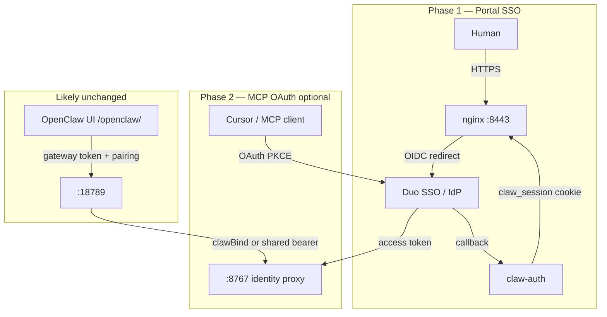

# Duo SSO integration guide (clawlab)

Reference plan for replacing local portal passwords and user-managed MCP PATs with
**Cisco Duo** authentication. This document is **not implemented today** — clawlab
currently uses **claw-auth** (SQLite + username/password sessions) and MCP PATs
(`skops_…`).

Related: [ARCHITECTURE.md](ARCHITECTURE.md) · [claw-auth/README.md](../claw-auth/README.md) ·
[ssh-ops-mcp/README.md](../ssh-ops-mcp/README.md)

---

## Current auth layers

Clawlab has **three separate auth mechanisms**. Duo does not replace all of them with
one switch — choose which token type to eliminate.

| Layer | Today | Duo can replace? |
|-------|-------|------------------|
| **Portal login** (hub, MCP Admin, DefenseClaw) | Local username/password → `claw_session` cookie | **Yes** — Duo SSO (OIDC/SAML) |
| **MCP client auth** (Cursor, external tools) | User-created PATs (`skops_…`) | **Yes** — Duo MCP / OAuth 2.1 (needs code) |
| **OpenClaw Control UI** | Gateway token in URL + device pairing | **Not via portal SSO today** — separate path |
| **OpenClaw → MCP** (from hub) | Short-lived `clawBind` after portal login | **Keep** — session-derived, not a PAT |
| **Gateway → identity proxy** | Shared machine bearer (internal) | **Keep** — service-to-service, not user auth |

**Recommended first step:** Duo SSO for **portal login**. That removes local passwords
and lets the hub / `clawBind` path work without users managing PATs for OpenClaw-from-portal.

---

## Target architecture (phased)



---

## Phase 1: Duo SSO for portal (replace local password login)

Touches **claw-auth** and **Duo Admin**. nginx, Flask GUIs, and RBAC stay as-is if SSO
still ends in a `claw_session` cookie and `/verify` still returns `X-Auth-User` /
`X-Auth-Role`.

### What stays the same

- nginx `auth_request` → `/_claw_auth/verify` (see `claw-portals/install-portals.sh`)
- Session cookie model (`claw_session`, HttpOnly)
- MCP bind tokens (`/mcp/bind`) — issued **after** SSO session exists
- PAT API — optional fallback or remove later
- OpenClaw `/openclaw/` — still gateway token + device pairing (nginx auth breaks WebSockets)

### Code changes in clawlab

| Area | Change |
|------|--------|
| **`claw-auth/authd.py`** | Add OIDC (or SAML) routes: `/login/sso`, `/oauth/callback`, optional `/oauth/logout`; keep `/verify` unchanged |
| **`claw-auth/store.py`** | JIT user provisioning on first SSO login; optional `external_id` / `idp_subject` column; password optional for SSO-only users |
| **Role mapping** | Map Duo groups → `operator` / `admin` / `superadmin` (config or env) |
| **Login UI** | “Sign in with Duo” button; optionally disable local password form |
| **`requirements.txt`** | Add OIDC client library (e.g. Authlib) |
| **`claw-auth.service`** | New env vars for IdP (below) |
| **`~/.claw-portals/config.env`** | Feature flags: `CLAW_AUTH_SSO_ENABLED=1`, issuer URLs, group map |
| **Docs / install** | `install-portals.sh` prompt or flag for SSO mode; document first-admin bootstrap |

**Minimal integration pattern:** SSO callback succeeds → look up or create user in
`~/.claw-auth/users.db` → `store.create_session(username)` → set the same cookie as today.
Downstream apps need zero changes.

**Stable username requirement:** RBAC, PAT ownership, Webex four-eyes, and change audit
all key off **claw-auth username**. Map Duo `preferred_username` or `email` consistently
(and store IdP subject for renames).

### Duo Admin configuration (portal SSO)

Use **Duo Single Sign-On** (OIDC is the simplest fit for claw-auth).

#### 1. Create the application

In Duo Admin → **Applications** → **Protect an Application**:

- Choose **OpenID Connect (OIDC)** or **Generic SAML** (OIDC preferred for claw-auth)
- If using **Duo as IdP** with an upstream IdP (Okta, Azure AD), configure federation
  and register clawlab as the relying party

#### 2. Application settings (OIDC example)

| Setting | Value |
|---------|-------|
| **Name** | `clawlab-portal` (or your hostname) |
| **Redirect URI(s)** | `https://<your-host>:8443/_claw_auth/oauth/callback` |
| **Logout URL** (optional) | `https://<host>:8443/_claw_auth/logout` |
| **Scopes** | `openid`, `profile`, `email` (add `groups` if your IdP exposes them) |
| **Response type** | `code` (authorization code; claw-auth is a confidential server-side client) |

#### 3. Credentials → claw-auth env

| Duo / IdP value | claw-auth env var |
|-----------------|-------------------|
| Client ID | `CLAW_AUTH_OIDC_CLIENT_ID` |
| Client secret | `CLAW_AUTH_OIDC_CLIENT_SECRET` (file or secret manager — never git) |
| Issuer / metadata URL | `CLAW_AUTH_OIDC_ISSUER` or `CLAW_AUTH_OIDC_DISCOVERY_URL` |
| Redirect URI | `CLAW_AUTH_OIDC_REDIRECT_URI` |

#### 4. MFA policy

Apply Duo policy on the SSO app (Push, passkey, Verified Duo Push, etc.). claw-auth
never sees the password; Duo handles step-up.

#### 5. Group → role mapping

| IdP / Duo group | clawlab role |
|-----------------|--------------|
| `clawlab-operators` | `operator` |
| `clawlab-admins` | `admin` |
| `clawlab-superadmins` | `superadmin` |

Configure as env JSON or a small map file read at login.

#### 6. TLS and hostname

- Production redirect URIs must match **exact** HTTPS host (`install-portals.sh` LE mode)
- `CLAW_AUTH_SECURE=1` for Secure cookies
- Register the same FQDN in Duo as users browse (`DOMAIN` in `~/.claw-portals/config.env`)

#### 7. Bootstrap / break-glass

- Keep one local `superadmin` with password **disabled in UI but available via CLI** for IdP outage, or
- Duo break-glass admin account

### Phase 1 rollout checklist

**Duo Admin**

- [ ] OIDC app for portal with correct redirect URI(s)
- [ ] MFA policy on that app
- [ ] Groups for role mapping

**clawlab host**

- [ ] HTTPS on portal port (`8443` + valid cert)
- [ ] `claw-auth.service` env for OIDC client id/secret/issuer
- [ ] Implement SSO routes + JIT provisioning in claw-auth
- [ ] Test `/verify` still returns headers for ssh-ops / DefenseClaw tabs
- [ ] Test hub → OpenClaw link still gets `clawBind` after SSO (no PAT needed)
- [ ] Document break-glass local admin

**User experience after Phase 1**

- User opens `https://lab:8443/` → redirected to Duo → lands in hub with session
- OpenClaw from hub uses `clawBind` (no PAT copy-paste)
- Cursor still needs PAT **until Phase 2** MCP OAuth is implemented

---

## Phase 2: Duo for MCP instead of PATs (`skops_…`)

The identity proxy on `:8767` has an OAuth discovery stub that is **not implemented**:

```python
# ssh-ops-mcp/mcp_identity_proxy.py
async def _oauth_discovery(_request: Request) -> Response:
    # TODO: MCP OAuth 2.1 authorization spec — protected resource metadata here.
    return JSONResponse({"error": "not implemented"}, status_code=404)
```

To replace PAT paste in Cursor / Claude Desktop with Duo:

### Duo Admin (MCP application)

Per [Duo MCP SSO docs](https://duo.com/docs/sso-oauth-server-mcp):

1. **Applications** → add **Model Context Protocol (MCP)** app type (not generic OIDC)
2. Register resource URL: `https://<host>:8767/mcp` (clients must hit **8767**, not raw **8766**)
3. Configure allowed MCP client types (e.g. Cursor) and tool policies if using **Duo Agentic Identity**
4. Map scopes/claims → username for RBAC (same stable username as portal)
5. Enable MFA policy for MCP OAuth if required

### Code changes in clawlab

| Component | Change |
|-----------|--------|
| **`mcp_identity_proxy.py`** | Implement `/.well-known/oauth-protected-resource`; OAuth token introspection or JWT validation against Duo |
| **`mcp_identity.py`** | Accept Duo-issued bearer tokens in addition to `skops_` PATs (migration window) |
| **`claw-auth`** | Optionally stop issuing PATs; or keep for break-glass |
| **TLS on :8767** | MCP OAuth expects HTTPS; ensure proxy cert matches Duo app URL |
| **Tests** | Extend `tests/test_mcp_pat_auth.py` for OAuth token path |

### Client configuration (after Phase 2)

Instead of:

```http
Authorization: Bearer skops_…
```

Cursor / Claude use Duo MCP OAuth (client discovers metadata from
`/.well-known/oauth-protected-resource`, user signs in once, client refreshes tokens).

### Phase 2 rollout checklist

**Duo Admin**

- [ ] MCP app on `:8767` with correct resource URL
- [ ] Client allowlist (Cursor, etc.)
- [ ] MFA policy if required

**clawlab host**

- [ ] Implement OAuth protected-resource metadata on identity proxy
- [ ] Token validation path in `mcp_identity.py`
- [ ] HTTPS on MCP proxy port
- [ ] Migration: accept both PAT and OAuth during transition
- [ ] Update ssh-ops-mcp README for OAuth client setup

---

## Phase 3 (optional): Duo Agentic Identity + MCP gateway

If adopting **Duo Agentic Identity** with an MCP gateway (Cisco Secure Access, Envoy, etc.):

- Put the **gateway in front of `:8767`**
- Duo becomes the **authorization engine** (per-tool-call policy)
- clawlab identity proxy may sit upstream of the gateway or be partially replaced

This is a larger architectural shift than SSO in claw-auth; only needed for
enterprise **tool-level authZ**, not just “who is the user.”

See [Duo Agentic Identity](https://duo.com/blog/introducing-duo-agentic-identity) and
[Cisco Astrix NHI integration](https://blogs.cisco.com/news/cisco-announces-intent-to-acquire-astrix-security)
for the broader Cisco control-plane story.

---

## What you do not need to change (portal SSO only)

| Component | Why |
|-----------|-----|
| **ssh-ops Flask GUI** | Already trusts `X-Auth-User` from nginx |
| **DefenseClaw web GUI** | Same |
| **nginx `auth_request` block** | Same `/verify` contract |
| **`clawlab-mcp-identity` plugin + `clawBind`** | Still the right OpenClaw path after SSO login |
| **`sync-openclaw-gateway-mcp-auth.sh`** | Internal machine bearer — unrelated to human SSO |
| **OpenClaw gateway token** | Separate from portal; OpenClaw limitation on same-host nginx session |

---

## Effort estimate

| Phase | Scope | Rough effort |
|-------|-------|--------------|
| **1 — Portal SSO** | claw-auth OIDC + Duo app + role map | Small–medium |
| **2 — MCP OAuth** | Identity proxy + Duo MCP app + client testing | Medium |
| **3 — Agentic gateway** | New gateway tier + policy model | Large |

---

## Summary

| Goal | Action |
|------|--------|
| Replace local portal passwords | **Phase 1** — OIDC SSO in claw-auth + Duo OIDC app |
| Remove PAT copy-paste for OpenClaw-from-hub | **Phase 1** (via existing `clawBind` after SSO) |
| Remove PAT copy-paste for Cursor / external MCP | **Phase 2** — MCP OAuth on `:8767` + Duo MCP app |
| Per-tool MCP authorization | **Phase 3** — Duo Agentic Identity + gateway |

**Bottom line:** Implement **OIDC SSO in claw-auth** (Phase 1) and configure a **Duo OIDC
application** pointing at `/_claw_auth/oauth/callback`. Keep internal machine tokens and
OpenClaw gateway auth as-is. Eliminate Cursor PAT paste with **Phase 2**.

---

## References

- [Duo MCP SSO documentation](https://duo.com/docs/sso-oauth-server-mcp)
- [Duo Agentic Identity announcement](https://duo.com/blog/introducing-duo-agentic-identity)
- [claw-auth README](../claw-auth/README.md) — current session and nginx flow
- [docs/ARCHITECTURE.md](ARCHITECTURE.md) — ports and auth model
